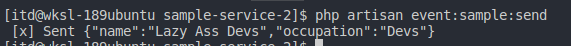

# Sample Service 2

## Getting Started
Sample service built in lumen. For now, this is the sender. see [sample-service-1](https://github.com/lazy-ass-devs/sample-service-1) for the receiver example

### Prerequisites

What things you need to install the software and how to install them
* lumen
* composer
* RabbitMQ

### Installing

copy the repository 
```
git clone
```

install all the dependencies
```
composer install
```

## Running the tests

Send an event
```
php artisan event:sample:send
```


After that... make sure to check the [sample-service-1](https://github.com/lazy-ass-devs/sample-service-1) repoistory

## How to Laravel Way
Create an event and you will dispatch it.
https://laravel.com/docs/5.8/events

Check the [**app/Listeners/ExampleListener**, **app/Events/ExampleEvent.php**, **app/Publishers/RabbitMQPublisher**] files for the implementation.

